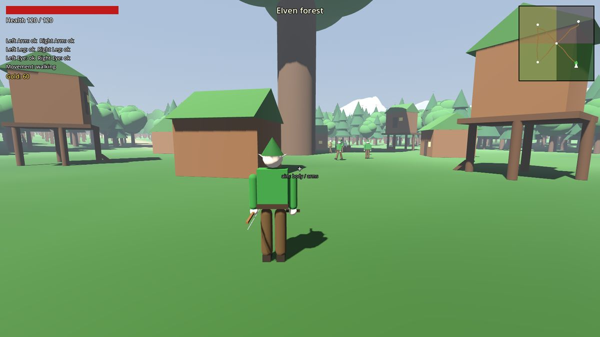
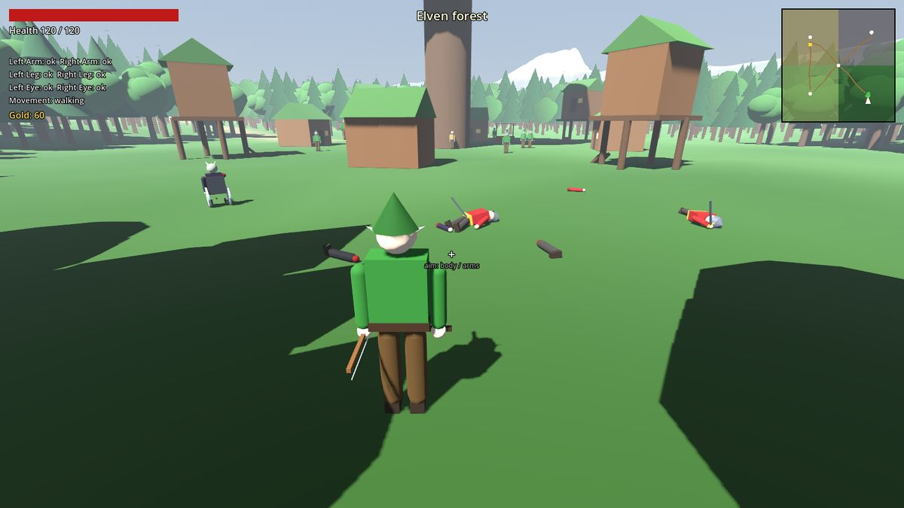
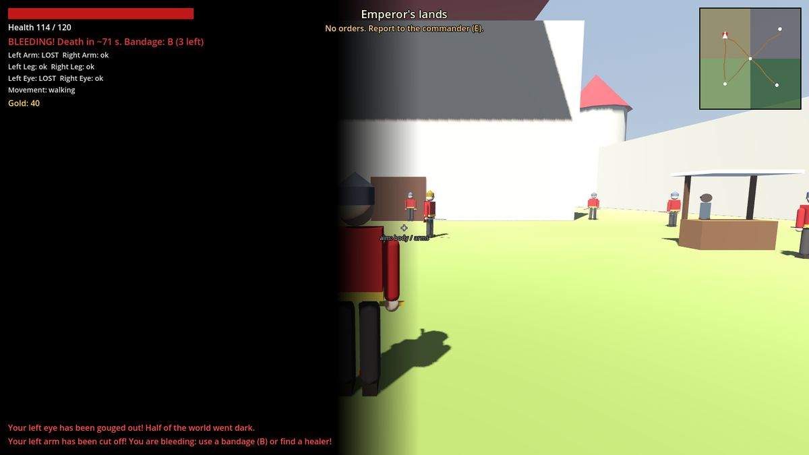
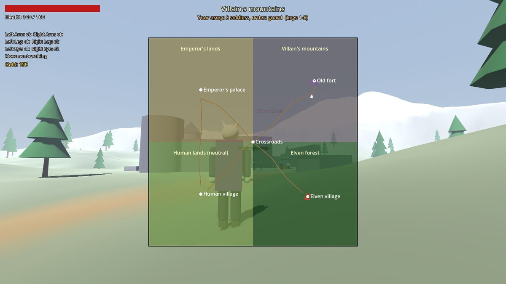

# Korovany (Godot 4.5)

A 3D action RPG built from the request in the repository's top-level `README.md`.
Play as a **forest elf**, a **palace guard** or **the Villain** (whose name was
never invented), in a world of four zones. You can rob caravans.



## Tech stack

Everything is free and open source. No paid libraries or assets.

| Part | Choice |
|---|---|
| Engine | Godot 4.5 (MIT) |
| Language | GDScript |
| Rendering | Forward+ on desktop. Compatibility (WebGL 2) on the web, set in `project.godot` |
| Physics | Jolt (built into Godot 4.4+): character movement, ragdolls, severed limbs, arrows |
| Content | Procedural. Terrain, buildings, trees and characters are generated in code, so there are no binary assets |

## Run it

1. Install [Godot 4.5 or newer](https://godotengine.org/download) (Linux, Windows or macOS).
   It is tested on 4.5 and 4.7.
2. Import the project once after cloning. Either open `godot/project.godot` in the
   editor, or run this from the repository root:

   ```bash
   godot --headless --path godot --import
   ```

   The scripts use global class names (`Factions`, `World`, `HUD` and so on).
   Godot keeps the list of those names in the `.godot/` cache, which is not in
   git. Without the import, the game fails with errors such as
   `Identifier "Factions" not declared in the current scope`. Import again if
   you delete `.godot/`.
3. Press **F5** in the editor, or run `godot --path godot` from the repository root.

If you installed Godot from Flathub, replace `godot` with
`flatpak run org.godotengine.Godot` in every command in this README:

```bash
flatpak run org.godotengine.Godot --headless --path godot --import
flatpak run org.godotengine.Godot --path godot
```

### Export

Install the export templates first (*Editor → Manage Export Templates*). Then
build from the command line:

```bash
godot --headless --path godot --export-release "Linux"   ../build/linux/korovany.x86_64
godot --headless --path godot --export-release "Web"     ../build/web/index.html
godot --headless --path godot --export-release "Windows Desktop" ../build/windows/korovany.exe
```

The Web preset is single-threaded, so any static web server (itch.io, GitHub
Pages) can host it without special headers.

## Controls

| Key | Action |
|---|---|
| WASD, Shift, Space | Move, sprint, jump |
| Mouse, wheel | Look, camera distance |
| LMB | Sword. **Look up** to aim at the head and eyes, **look down** to aim at the legs |
| RMB | Bow (elves). Needs both hands |
| E | Talk, trade, get treatment, rob a caravan, search a body |
| B / H | Bandage (stops bleeding) / healing potion |
| I or Tab | Inventory: use or equip items, fit prostheses |
| M | Big map |
| F5 / F9 | Save / load |
| 1–5 | Villain only: army orders (follow, hold, attack the palace, raid the elves, return to the fort) |
| Esc, F1 | Menu, controls help |

## What's in the game (mapped to the request)

| Request | Implementation |
|---|---|
| Play as elves, the palace guard or the Villain | Chosen in the main menu. Each has its own start, allies, enemies and goals |
| Elves: forest, wooden houses, raids by soldiers and villains | Elven village of wooden houses (some on stilts) around a great tree. Palace soldiers and the Villain's troops raid it on a timer |
| Rob caravans | Ox wagons with guards travel the roads between the zones. Kill or dodge the guards, press **E**, then sell the goods to a merchant. Robbing costs reputation with the humans |
| Dense forest; distant trees are pictures that turn 3D up close | About 6,800 trees in 40 m cells. Each cell has a 3D MultiMesh up close and a camera-facing impostor MultiMesh far away; Godot visibility ranges crossfade between them at 75 m (`scripts/world/forest.gd`) |
| Buying things "like in Daggerfall" | Merchants and healers in every settlement sell weapons, armor, bandages, potions, prostheses and wheelchairs. They also buy loot |
| 3D enemies and 3D corpses | Procedural 3D humanoids. On death the body becomes a jointed ragdoll that stays in the world and can be searched |
| Jumping | Space |
| Guard: obey the commander, defend the palace, go on raids | Report to the commander (E) to get orders: defend the palace from spies and elven partisans, or raid the elves or the fort. Stray more than 60 m from the commander during a raid and you're warned, then declared a deserter: the mission fails and you get no pay |
| Villain: be your own commander, attack the palace with your troops | You start with an army in the old fort. Keys 1–5 give orders, and you can recruit more troops at the fort. Elven spies and partisans sometimes attack the fort. Kill every defender near the palace and it falls |
| 4 zones: humans (neutral), Emperor (palace), elves, Villain (mountains, old fort) | Four quadrants of an 800×800 m map, connected by roads through a crossroads. The Villain's zone is mountainous, with the ruined fort on a plateau |
| Cut off an arm: you die unless healed | Hits land on a body part. A limb can be cut off and flies away as a physics object. You bleed until you bandage or get treated; if you don't, you die |
| Gouge out an eye: half the screen goes dark; buy or find a prosthesis | Each lost eye darkens half the screen. An enchanted glass eye restores sight |
| Leg: die, crawl, wheelchair, or (best) a prosthesis | A lost leg bleeds, and once you survive you crawl. A wheelchair lets you ride instead; a prosthetic leg lets you walk and jump again |
| Saving | F5/F9 or the pause menu. Saves the whole world: every NPC with their wounds and orders, caravans, corpses, missions and reputation. Uses JSON in `user://`, which is IndexedDB on the web |





## Project layout

```
godot/
  project.godot, main.tscn, export_presets.cfg
  scripts/
    main.gd                 entry: menu or world
    autoload/game.gd        global state, hostility, reputation, input map, save/load
    world/world.gd          terrain, zones, roads, settlements, road-graph pathfinding
    world/forest.gd         dense forest with 3D and impostor LOD
    actors/actor.gd         health, body parts, bleeding, prostheses, combat, death
    actors/humanoid.gd      procedural body, animation, blood, wheelchair
    actors/npc.gd           AI: orders, combat, following, escorting, fleeing
    actors/player.gd        third-person controller, aiming, items
    actors/corpse.gd        ragdolls and looting
    actors/caravan.gd       caravans
    actors/projectile.gd    arrows
    systems/director.gd     population, raids, spies, caravans, missions, army, save data
    systems/factions.gd     factions and base hostility
    systems/item_db.gd      items and shop stock
    ui/                     HUD and dialogs, minimap, main menu
  tests/
    smoke_test.tscn         headless test of every system (run it before committing)
    screenshots.tscn        renders the screenshots in docs/
```

## Tests

```bash
godot --headless --path godot --import                 # after a fresh clone
godot --headless --path godot res://tests/smoke_test.tscn
```

The smoke test builds the world for each faction and checks:

- ground and jumping
- dismemberment, bleeding to death, the death screen and corpses
- the half-screen eye overlay and the glass eye
- crawling, the wheelchair and the prosthetic leg
- commander missions, shopping, caravan robbery and save/load
- the Villain's army and recruiting, NPC fights and player hits

It then lets each world run for 160 s of game time and checks that raids, caravans
and marching armies keep working. It exits with code 1 on any failure.

## Known limitations and next steps

- All art is placeholder geometry. Next steps are Blender or CC0 models
  (Quaternius, Kenney, Poly Haven), Mixamo animations and a real skeleton.
- NPCs follow a road graph with gate waypoints and steer locally. A baked
  navmesh would handle open terrain better.
- There is no sound yet.
